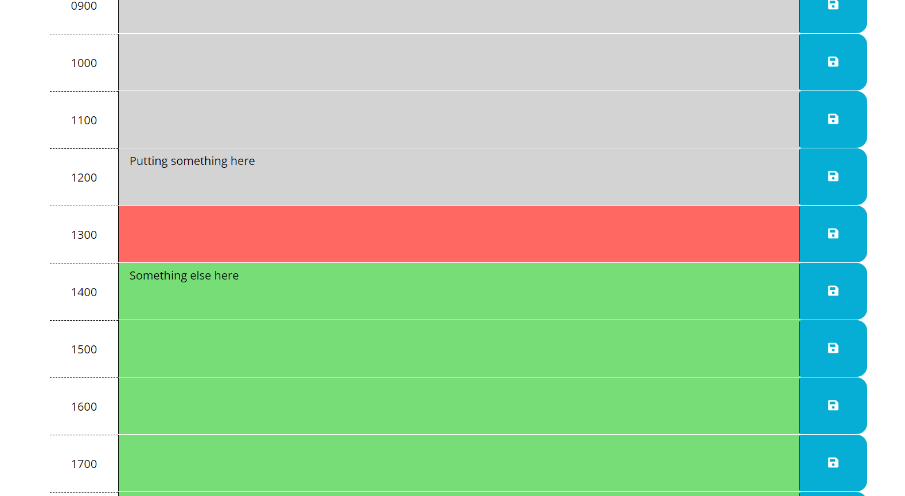

# daily-plan-maker
A 24 hour daily planner

Daily Plan Maker is a 24 hour day planner that allows used to save a task for each hour. When the task is in the future the task hour block is green. When the task is set to take place during the current hour the task block turns red. When the task hour block is in the past the block becomes grayed. Users are able to save tasks and the tasks remain if the browser is refreshed.

Daily Plan Maker application available at <https://jasonarritt.github.io/daily-plan-maker/>
